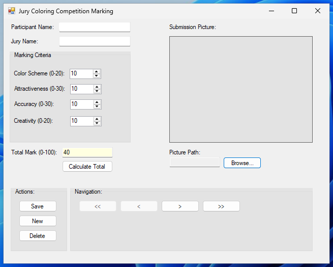

# Visual Basic .NET Coloring Contest Jury Marking Application

This is a simple Windows Forms application developed in VB.NET using Visual Studio 2010 to track submissions for a coloring competition. It allows users to enter participant and jury details, assign marks in different categories, calculate a total mark, link a picture of the submission, and save/manage entries using a Microsoft Access database.



## Prerequisites

Before you begin, ensure you have the following installed:

1.  **Visual Studio 2010:** The code is written for this specific version.
2.  **Microsoft Access (2007-2016):** You need Microsoft Access or the Microsoft Access Database Engine (available as a free download from Microsoft) installed to work with `.accdb` files. The database engine is required for your application to connect to the `.accdb` file at runtime.

## Setup Guide

Follow these steps to set up and run the application:

### 1. Create the Visual Studio Project

1.  Open **Visual Studio 2010**.
2.  Go to `File` > `New` > `Project...`.
3.  In the "New Project" dialog, expand `Visual Basic` and select `Windows`.
4.  Choose `Windows Forms Application`.
5.  Give your project a name (e.g., `ColoringCompetitionApp`).
6.  Click `OK`.

### 2. Add the VB.NET Code

1.  In the Solution Explorer (usually on the right), find `Form1.vb`.
2.  Double-click `Form1.vb` to open its code editor.
3.  **Replace the entire content** of the `Form1.vb` code with the corrected code provided previously.
4.  Save the file (`Ctrl + S`).

### 3. Design the Form (Form1.vb [Design])

The code interacts with controls on the form by their names. You need to add the following controls to `Form1` in the designer and set their `Name` property exactly as listed:

*   **Labels:** Add labels next to each input field (e.g., "Participant Name:", "Jury Name:", "Color Scheme:", etc.). These don't have specific names required by the code, but make them user-friendly.
*   **TextBoxes:**
    *   `txtParticipantName`
    *   `txtJuryName`
    *   `txtTotalMark` (Set its `ReadOnly` property to `True`)
    *   `txtPicturePath` (Set its `ReadOnly` property to `True`)
*   **NumericUpDowns:**
    *   `nudColorScheme` (Set `Minimum` to 0, `Maximum` to 20)
    *   `nudAttractiveness` (Set `Minimum` to 0, `Maximum` to 30)
    *   `nudAccuracy` (Set `Minimum` to 0, `Maximum` to 30)
    *   `nudCreativity` (Set `Minimum` to 0, `Maximum` to 20)
*   **Buttons:**
    *   `btnCalculateTotal`
    *   `btnBrowsePicture`
    *   `btnFirst` (For navigation)
    *   `btnPrevious` (For navigation)
    *   `btnNext` (For navigation)
    *   `btnLast` (For navigation)
    *   `btnNew`
    *   `btnSave`
    *   `btnDelete`
*   **PictureBox:**
    *   `picSubmission` (Set `SizeMode` property to `Zoom` or `StretchImage` to fit the picture box)
*   **OpenFileDialog:**
    *   Add an `OpenFileDialog` component from the Toolbox (under Dialogs). It will appear in the tray below the form. Set its `Name` property to `ofdPicture`. You can also set its `Filter` property to something like `Image Files|*.jpg;*.jpeg;*.png;*.bmp;*.gif|All files (*.*)|*.*`.

Arrange these controls on your form as desired.

### 4. Create the Microsoft Access Database

1.  Open **Microsoft Access**.
2.  Create a new **Blank Database**. Choose a name (e.g., `ColoringCompetition.accdb`) and a location.
3.  In the new database, create a new **Table**.
4.  Design the table with the following columns (Field Names) and Data Types. **Ensure the names are exactly as listed:**
    *   `SubmissionID` (AutoNumber, set as **Primary Key**)
    *   `ParticipantName` (Short Text / Text)
    *   `JuryName` (Short Text / Text)
    *   `Mark_ColorScheme` (Number - Integer)
    *   `Mark_Attractiveness` (Number - Integer)
    *   `Mark_Accuracy` (Number - Integer)
    *   `Mark_Creativity` (Number - Integer)
    *   `TotalMark` (Number - Integer)
    *   `PicturePath` (Short Text / Text)
5.  Save the table and name it `Submissions`. **Ensure the table name is exactly `Submissions`**.
6.  Close Microsoft Access.

### 5. Place the Database File

The VB.NET code uses `|DataDirectory|` which, during development in Visual Studio, points to the application's executable directory (usually `bin\Debug`).

1.  In Visual Studio, build your project (`Build` > `Build Solution`). This creates the `bin\Debug` folder within your project directory.
2.  Locate your project folder on your computer (e.g., `C:\Users\YourUser\Documents\Visual Studio 2010\Projects\ColoringCompetitionApp`).
3.  Navigate into the `bin\Debug` subfolder.
4.  Copy your `ColoringCompetition.accdb` file into this `bin\Debug` folder.

*(Note: For deployment, you would typically place the database file in the same folder as the deployed `.exe` file).*

### 6. Verify Connection String (Optional but Recommended)

The connection string in the code assumes the database file is in the `|DataDirectory|`. Double-check this line in `Form1.vb`:

```vb.net
Private dbConnectionString As String = "Provider=Microsoft.ACE.OLEDB.12.0;Data Source=|DataDirectory|\ColoringCompetition.accdb;Persist Security Info=False;"
```

If your database file is named differently or located elsewhere (and you prefer a fixed path for testing), you would modify this line. Ensure `Microsoft.ACE.OLEDB.12.0` is the correct provider for `.accdb` files; if you have an older Access version or are using `.mdb`, you might need `Microsoft.Jet.OLEDB.4.0`.

## How to Run

1.  In Visual Studio 2010, go to `Debug` > `Start Debugging` (or press `F5`).
2.  The application form should appear.

If the database loads successfully, the controls will become active. If there's an error connecting to the database, a message box will pop up, and the controls will remain disabled.

## Using the Application

*   **Navigation:** Use the "First", "Previous", "Next", "Last" buttons to browse existing records.
*   **New Entry:** Click the "New" button to add a new blank submission record.
*   **Enter Data:** Fill in the Participant Name, Jury Name, and marks using the TextBoxes and NumericUpDowns.
*   **Calculate Total:** Click "Calculate Total" to sum the individual marks and populate the "Total Mark" field.
*   **Browse Picture:** Click "Browse Picture" to select an image file (`.jpg`, `.png`, etc.) for the current submission. The path will appear in the Picture Path box, and the image will display.
*   **Save:** Click "Save" to persist the current entry (new or modified) to the database.
*   **Delete:** Select an entry and click "Delete" to remove it from the database (requires confirmation).

## Troubleshooting

*   **"Error loading data from database..."**:
    *   Verify that the `ColoringCompetition.accdb` file is located in the `bin\Debug` folder of your project.
    *   Ensure you have the Microsoft Access Database Engine installed for your version of Office/Windows. Search for "Microsoft Access Database Engine 2010 Redistributable" or similar if needed. Make sure the bitness (32-bit or 64-bit) of the engine matches the bitness of your Visual Studio project/application. VS 2010 typically builds 32-bit applications by default.
    *   Double-check the `dbConnectionString` in your code.
    *   Ensure the table name in the `OleDbDataAdapter` (`"SELECT * FROM Submissions"`) is exactly `Submissions`.
*   **Runtime errors mentioning control names (e.g., "Object reference not set to an instance of an object")**:
    *   Go back to the form designer (`Form1.vb [Design]`).
    *   Select each control and check its `Name` property in the Properties window. Make sure it exactly matches the names used in the VB.NET code (`txtParticipantName`, `nudColorScheme`, `btnSave`, `picSubmission`, etc.). Case sensitivity matters.
*   **"Picture file not found..."**:
    *   This warning appears if the path stored in the `PicturePath` column of the database entry does not point to an existing file on your computer.
*   **Save/Delete Errors**:
    *   Ensure your application has write permissions to the `ColoringCompetition.accdb` file.
    *   Verify the table structure (column names and data types) in your Access database matches the list provided in Step 4 of the Setup Guide.

## Credits

*   Code provided by the user.
*   VB.NET 2010 compatibility fixes and tutorial provided based on user request.

## License

This code is provided for educational purposes.
